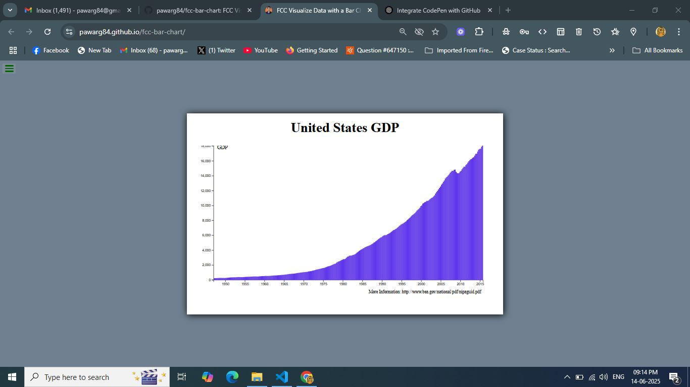

# 📊 FCC Bar Chart - United States GDP

An interactive bar chart that visualizes the Gross Domestic Product (GDP) of the United States over time. Built as part of the [freeCodeCamp Data Visualization Certification](https://www.freecodecamp.org/learn/data-visualization/data-visualization-projects/visualize-data-with-a-bar-chart) project.

> ✅ Built using **D3.js**, **HTML**, **CSS**, and **JavaScript**

---

## 📌 Live Demo

🔗 [View Live on GitHub Pages](https://pawarg84.github.io/fcc-bar-chart/)



---

## 🚀 Features

- 📈 Visualizes GDP data from 1947 to 2015
- 🧠 Tooltip on hover to show exact values and dates
- ✅ Responsive design with modern layout
- 🧪 FCC test suite integrated for auto-validation

---

## 🛠 Tech Stack

- **HTML5**
- **CSS3**
- **JavaScript (ES6+)**
- **D3.js v7**
- **Fetch API**
- **FCC Testable Projects Bundle**

---

## 📁 Project Structure

```
fcc-bar-chart/
│
├── index.html       # Main HTML file
├── style.css        # CSS styles
├── script.js        # D3.js script
├── screenshot.png   # Screenshot of the chart
└── README.md        # You're here
```

---

## 📦 Installation & Local Setup

```bash
# Clone the repo
git clone https://github.com/pawarg84/fcc-bar-chart.git

# Navigate into project
cd fcc-bar-chart

# Open in your browser
open index.html
```

> Or just drag and drop `index.html` into your browser.

---

## 📚 Data Source

Data provided by [freeCodeCamp](https://raw.githubusercontent.com/freeCodeCamp/ProjectReferenceData/master/GDP-data.json).

---

## ✅ Certification Requirement

This project satisfies all user stories required by the **freeCodeCamp Data Visualization Certification** project:  
**"Visualize Data with a Bar Chart"**

---

## 👨‍💻 Author

**Ganesh Pawar**  
[GitHub](https://github.com/pawarg84) | [CodePen](https://codepen.io/ganeshp007)

